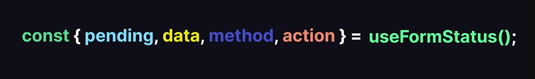

<h1  align="center" > 🍄 𝐔𝗌𝖾 𝐅ⱺ𝗋ꭑ 𝐒𝗍α𝗍υ𝗌 🥠</h1>

useFormStatus is a Hook that gives you status
information of the last form submission.



```JSX

//============ App.jsx ============== 

import Form from "./components/Form";

const App = () => {
  return (
    <div>
      <Form />
    </div>
  );
};

export default App;

```

```JSX

//============ components/Form.jsx ============== 

import FormButton from "./FormButton";

function Form() {
  const myAction = async (formData) => {
    await new Promise((resolve) => setTimeout(resolve, 2000));
    const newPost = {
      title: formData.get("name"),
      email: formData.get("email"),
    };
    console.log(newPost);
  };

  return (
    <form action={myAction}>
      <div>
        <label htmlFor="name">Name:</label>
        <input
          className="border-2"
          type="text"
          id="name"
          name="name"
          required
        />
      </div>

      <div>
        <label htmlFor="email">Email:</label>
        <input
          className="border-2"
          type="email"
          id="email"
          name="email"
          required
        />
      </div>

      <FormButton />
    </form>
  );
}

export default Form;

```

```JSX

//============ components/FormButton.jsx ============== 

import { useFormStatus } from "react-dom";

const FormButton = () => {
  const { pending } = useFormStatus();

  return (
    <button type="submit" disabled={pending}>
      {pending ? "Submitting..." : "Submit"}
    </button>
  );
};

export default FormButton;

```